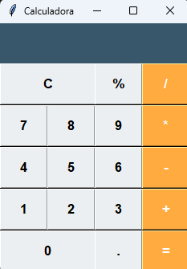

# Calculadora em Python com Tkinter

Este projeto é uma calculadora simples desenvolvida em Python utilizando a biblioteca Tkinter para a interface gráfica. A calculadora permite realizar operações básicas como adição, subtração, multiplicação e divisão.

## Pré-requisitos

Para executar este projeto, você precisa ter o Python instalado em sua máquina. Você pode baixar o Python [aqui](https://www.python.org/downloads/).

## Como executar

1. Clone este repositório para o seu ambiente local:

    ```bash
    git clone https://github.com/catanozi/calculadora.git
    ```

2. Navegue até o diretório do projeto:

    ```bash
    cd calculadora-tkinter
    ```

3. Execute o script `calculadora.py`:

    ```bash
    python calculadora.py
    ```

## Funcionalidades

- Adição
- Subtração
- Multiplicação
- Divisão

## Capturas de Tela




